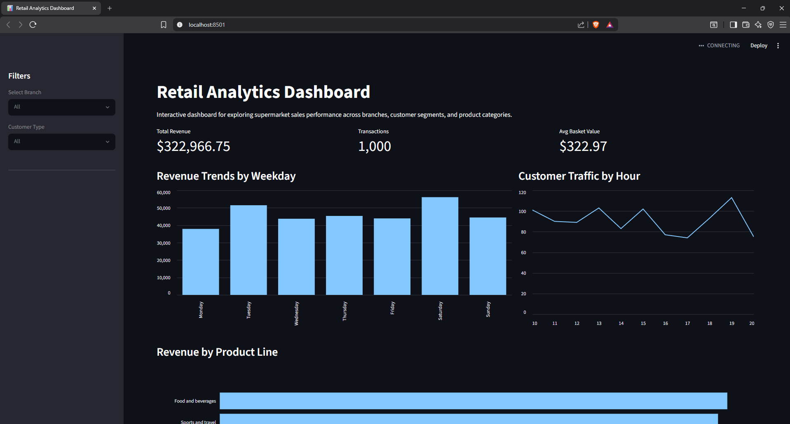

[Live Dashboard](https://retail-analytics-dashboard-1.streamlit.app/)

# Retail Analytics Dashboard

An interactive dashboard built with Python, Pandas, Streamlit, and Plotly for analyzing supermarket sales data.

The dashboard allows users to explore sales performance, customer behavior, product performance, and transaction patterns through interactive filters and visualizations.

## Dashboard Features

• Revenue KPI
• Transaction KPI
• Average Basket Value KPI

• Branch Filter
• Customer Type Filter

• Revenue Trends by Weekday
• Customer Traffic by Hour
• Revenue by Product Line

## Key Findings

• Saturday generated the highest revenue while Monday generated the lowest.
• Customer traffic peaked around 19:00 and declined noticeably around 16:00–17:00.
• Revenue was relatively balanced across all product lines, with Food and Beverages leading slightly.
• Members generated slightly higher revenue than normal customers despite similar transaction counts.
• Branch performance and customer ratings were highly consistent across locations.

## Technologies Used

• Python
• Pandas
• Streamlit
• Plotly
• Matplotlib
• Git
• GitHub

## How to Run

git clone https://github.com/yarchi2k3/retail-analytics-dashboard.git

cd retail-analytics-dashboard

pip install -r requirements.txt

streamlit run dashboard/app.py

## Dashboard Preview

